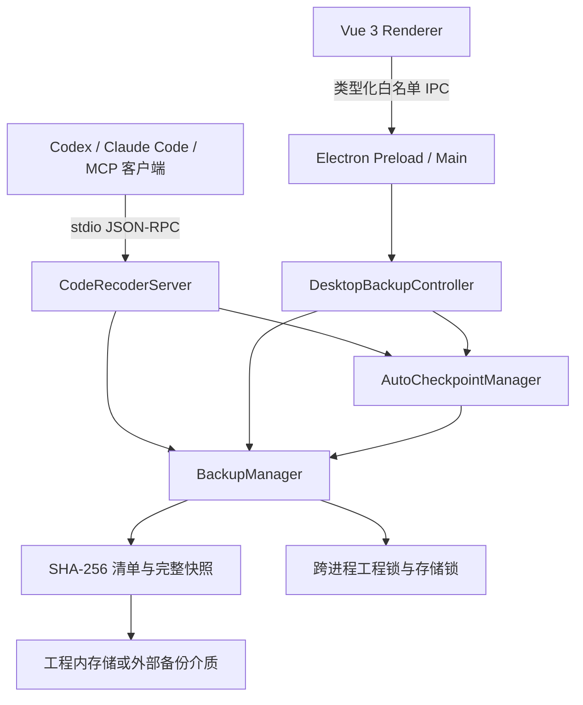
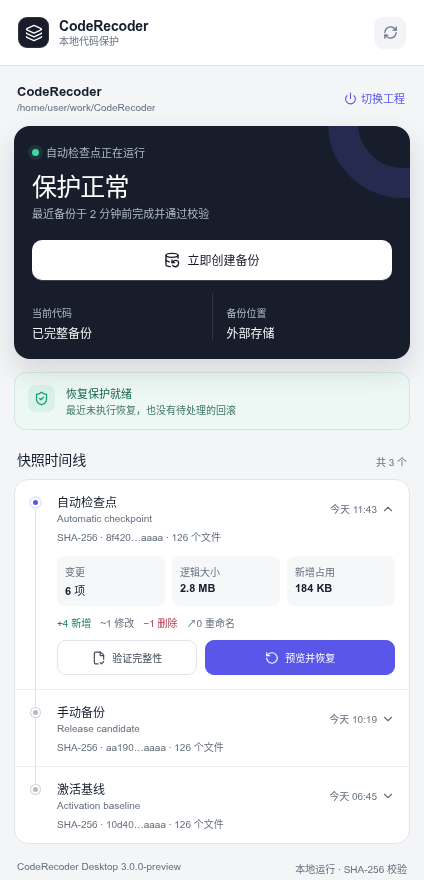
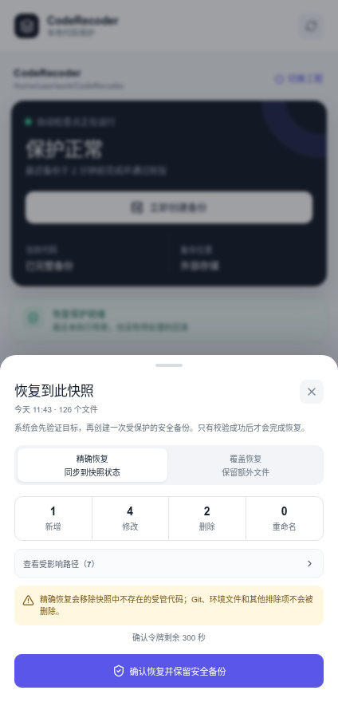

# CodeRecoder

CodeRecoder 是一个本地优先的代码备份与可验证恢复系统，同时提供 MCP 服务和 Vue 3 + Electron 桌面控制台。它面向 Codex、Claude Code 及其他支持 MCP 的开发工具，也可以作为独立桌面小窗运行。

当前版本：`3.0.0`

> CodeRecoder 不替代 Git。Git 负责协作、审查、分支和发布历史；CodeRecoder 负责在 AI 编程和高频修改过程中自动保留可恢复副本，并在恢复前后提供完整性证据。

## 核心能力

| 能力 | 当前实现 |
| --- | --- |
| 完整工程备份 | 每个快照都是逻辑完整、可独立恢复的文件树 |
| 存储去重 | 未变化的普通文件通过硬链接复用，变化文件写入新副本 |
| 完整性证据 | SHA-256 清单记录路径、类型、内容、权限、大小和整棵树哈希 |
| 自动检查点 | `chokidar` 监听、防抖合并、备份期间排队和周期性对账 |
| 安全恢复 | 强制预览、短期确认令牌、恢复前安全快照、恢复后校验 |
| 自动回滚 | 恢复失败时回到操作前状态；进程中断后可在下次初始化时恢复 |
| 并发协调 | 存储锁与工程锁带心跳、超时和失效锁恢复 |
| 双控制入口 | stdio MCP 服务与 Vue 3/Electron 桌面控制台复用同一备份内核 |

## 架构



- `BackupManager` 是唯一生产备份内核，负责扫描、快照、清单、验证、保留策略、恢复和启动恢复。
- `AutoCheckpointManager` 只负责监听和调度，最终仍通过 `BackupManager` 创建经过验证的完整快照。
- MCP 与桌面端分别维护进程内激活状态，不会持久化或争用一个全局“当前工程”。
- 两个入口同时保护同一工程时，工程级跨进程锁会串行化写入和恢复操作。

## 系统要求

- Node.js `22.12.0` 或更高版本
- npm
- 桌面端需要可用的图形会话
- 完整测试使用操作系统临时目录；旧版 shell 迁移测试依赖 Bash/Linux 工具

## 安装

```bash
git clone https://github.com/snow-wind-001/CodeRecoder.git
cd CodeRecoder
npm install
npm run lint
npm test
```

`npm test` 会构建 MCP 服务、检查桌面 TypeScript，并运行备份、恢复、并发、自动检查点、MCP 生命周期、stdio 和桌面控制器测试。

## 快速开始：桌面控制台

```bash
npm run desktop:start
```

| 备份总览 | 恢复预览与安全确认 |
| --- | --- |
|  |  |

首次启动后：

1. 选择需要保护的工程目录。
2. 选择外部备份根目录；推荐使用独立磁盘或专用备份目录。
3. 决定是否启用自动检查点，并设置普通快照保留数量。
4. 点击“启动保护”，等待基线备份创建并通过校验。

桌面窗口默认内容尺寸为 `424×880`，宽度限制为 `380–560px`，适合放在编辑器旁边。界面提供：

- 自动检查点健康度和未备份变更提示；
- 快照时间线、变更数量、逻辑大小、新增占用和树哈希摘要；
- 手动创建备份和重新验证完整性；
- `exact`/`overlay` 恢复预览、受影响路径和令牌倒计时；
- 恢复成功、恢复拒绝、自动回滚或回滚失败的明确状态。

桌面端不提供永久删除按钮；删除备份仍需通过 MCP 工具进行双 ID 确认。更多说明见 [`desktop/README.md`](./desktop/README.md)。

### 安装到 Ubuntu/GNOME 程序栏

```bash
npm run desktop:install-linux
```

该命令以当前用户身份安装 `coderecoder.desktop`，刷新应用列表并固定到 GNOME Dock，不需要 `sudo`。启动项会自动寻找满足要求的 NVM Node.js，并从当前仓库构建、启动桌面端；因此移动或删除仓库后需要重新运行安装命令。再次点击图标会唤醒已有窗口。

### 桌面开发命令

```bash
npm run desktop:dev       # 构建内核并启动 Electron/Vite 热更新
npm run desktop:renderer  # 只启动浏览器渲染层，供界面开发使用
npm run desktop:typecheck # 检查 renderer、preload 和 Electron 主进程
npm run desktop:build     # 生产构建到 dist-desktop/
npm run test:desktop      # 桌面控制器集成测试
```

### 多工程与多开策略

当前 `3.0.0` 桌面端采用**单 Electron 实例、单活动工程**模型：`DesktopBackupController` 只保存一个活动会话，第二次启动会聚焦现有窗口；点击“切换工程”时会先尝试创建最终检查点，再停止旧工程监听。因此，当前桌面窗口不能同时监控多个任务工程，也不需要、且默认不允许多开多个 Electron 进程。

MCP 入口可以由不同客户端启动多个独立服务进程，每个进程各激活一个工程。它们共享同一备份内核；若指向同一工程或存储位置，跨进程锁会串行化关键操作。需要立即并行保护多个工程时，推荐为每个任务工程配置独立 MCP 进程和独立外部备份根目录。

桌面端后续更合理的演进方式不是复制多个应用进程，而是在单进程内增加工程会话注册表：每个工程拥有独立的 `BackupManager`、`AutoCheckpointManager` 和健康状态，主窗口提供工程切换器及汇总告警；确有并排观察需求时，再由同一 Electron 进程创建多个 `BrowserWindow`。这样能避免重复监听、额外内存占用和退出检查点状态冲突。

## 快速开始：连接 MCP 客户端

先构建 stdio 服务：

```bash
npm run build
```

### Codex CLI / IDE

```bash
codex mcp add coderecoder -- node /absolute/path/CodeRecoder/dist/index.js
codex mcp list
```

也可以在 `~/.codex/config.toml` 中配置：

```toml
[mcp_servers.coderecoder]
command = "node"
args = ["/absolute/path/CodeRecoder/dist/index.js"]
cwd = "/absolute/path/CodeRecoder"
```

### Claude Code

```bash
claude mcp add --scope user coderecoder -- node /absolute/path/CodeRecoder/dist/index.js
claude mcp list
```

其他 MCP 客户端使用等价的 stdio 配置即可。stdout 专用于 MCP JSON-RPC，所有诊断信息写入 stderr。不要在包装脚本中把普通日志输出到 stdout。

更多配置示例和批准策略见 [`MCP_CONFIG_GUIDE.md`](./MCP_CONFIG_GUIDE.md)。

## 推荐备份工作流

### 1. 激活工程

`activate_project` 会初始化存储、执行启动恢复检查、创建经过验证的基线，并默认启动自动检查点。

```json
{
  "projectPath": "/work/my-project",
  "projectName": "my-project",
  "storageRoot": "/data/coderecoder",
  "autoCheckpoint": true,
  "debounceMs": 1500,
  "reconciliationIntervalMs": 60000,
  "maxBackups": 100,
  "excludeNames": ["vendor-generated"]
}
```

当 `storageRoot` 存在时，实际工程存储目录为：

```text
<storageRoot>/<project-name>-<project-path-hash>/
```

省略 `storageRoot` 时，默认写入 `<project>/.CodeRecoder/backups/`。如果不希望向源工程写入任何元数据，应始终指定外部目录。

### 2. 检查保护状态

调用 `get_backup_status`，重点检查：

- `hasUncheckpointedChanges` 是否为 `false`；
- `automaticCheckpoint.state` 是否为 `running`；
- `watcherReady` 是否为 `true`；
- `lastError` 是否为空；
- `latestSnapshot` 和 `currentMatchesSnapshot` 是否符合预期。

自动状态含义：

| 状态 | 含义 |
| --- | --- |
| `running` | 监听与检查点调度可用 |
| `paused` | 恢复或停用流程正在暂停监听 |
| `degraded` | 监听或检查点发生错误，应检查 `lastError` |
| `stopped` | 自动检查点未启用或已经停止 |

### 3. 创建命名备份

重要重构、升级或批量生成前，建议额外创建显式备份：

```json
{
  "name": "before-auth-refactor",
  "prompt": "认证模块重构前的稳定代码",
  "tags": ["stable", "auth"],
  "skipIfUnchanged": false
}
```

显式备份默认不会因为内容未变化而跳过，因此可以保留有业务意义的命名节点。

## 安全恢复

恢复必须分成预览和确认两个阶段。

### 第一步：生成预览

```json
{
  "snapshotId": "目标快照 UUID",
  "mode": "exact"
}
```

`preview_project_restore` 会：

1. 重新验证目标快照；
2. 扫描当前工程并计算新增、修改、删除和重命名路径；
3. 将当前树哈希、工程、目标快照和恢复模式绑定到确认令牌；
4. 返回五分钟有效、只能使用一次的 `confirmationToken`。

预览会在备份存储中写入短期确认记录，因此 MCP 元数据将其标记为非只读，但它不会修改源代码。

### 第二步：明确确认

```json
{
  "snapshotId": "同一个目标快照 UUID",
  "confirmationToken": "预览返回的令牌"
}
```

令牌过期、已使用、工程在预览后变化、工程/快照/模式不匹配时，恢复会被拒绝。不要手工构造令牌，也不要缓存后重复使用。

### 恢复模式

| 模式 | 行为 | 适用场景 |
| --- | --- | --- |
| `exact` | 将受管代码同步到快照状态，并移除快照中不存在的受管路径 | 完整回到已知代码状态 |
| `overlay` | 写入快照中的路径，但保留当前工程的额外文件 | 只覆盖已知文件，避免删除新增内容 |

两种模式都不会删除默认排除项。执行恢复前，系统必须先创建带 `protected` 标签的恢复前安全快照；执行后必须验证文件字节、类型和权限。失败时自动回滚，只有回滚也通过验证后才会报告 `rollbackState: restored`。

## MCP 工具参考

| 工具 | 主要参数 | 副作用与批准建议 |
| --- | --- | --- |
| `activate_project` | `projectPath`；可选存储、监听、保留和排除设置 | 创建基线并可能启动监听 |
| `deactivate_project` | `createFinalCheckpoint`，默认 `true` | 默认创建最终检查点并清理进程内状态 |
| `get_backup_status` | 无 | 只读，可用于周期健康检查 |
| `create_project_snapshot` | `name`、`prompt`、`tags`、`skipIfUnchanged` | 新增经过验证的备份并占用磁盘 |
| `list_project_snapshots` | `limit`，范围 `1–500`，默认 `50` | 只读，按时间倒序返回摘要 |
| `preview_project_restore` | `snapshotId`、`mode` | 写入短期令牌，不修改源工程 |
| `restore_project_snapshot` | `snapshotId`、`confirmationToken` | destructive；必须展示预览并取得明确确认 |
| `verify_project_snapshot` | `snapshotId` | 只读；重新计算内容和清单证据 |
| `delete_project_snapshot` | `snapshotId`、相同的 `confirmSnapshotId` | destructive；永久删除指定备份 |

恢复和删除工具不应加入客户端的无条件自动批准列表。

## 快照和存储模型

外部存储结构示例：

```text
/data/coderecoder/
└── my-project-a1b2c3d4e5f6a7b8/
    ├── index.json
    ├── pending/                       # 短期恢复确认记录
    ├── restore-recovery.json          # 恢复事务日志；异常时会保留
    └── snapshots/
        └── <snapshot-uuid>/
            ├── manifest.json
            └── tree/                  # 可独立恢复的完整逻辑文件树
```

每个清单包含：

- 快照 ID、名称、标签、触发来源和创建时间；
- 父快照 ID、完整工程树哈希和 SHA-256 算法标识；
- 文件、目录和符号链接条目；
- 普通文件内容哈希、大小和权限；
- 新增、修改、删除和推断重命名统计；
- 逻辑大小、实际新增占用及硬链接去重统计；
- 可获取时的 Git 分支和短提交证据。

快照在逻辑上彼此独立；删除任意一个普通快照不会破坏其他快照的目录结构。物理去重使用硬链接，因此直接篡改备份树中的某个共享文件可能同时影响多个快照。不要手工编辑存储目录，应使用 `verify_project_snapshot` 检测损坏，并把备份根目录复制到独立介质以获得真正的灾难恢复能力。

## 默认排除规则

默认按任意路径段排除：

```text
.CodeRecoder  .git  .hg  .svn  node_modules  dist  build  coverage
.next  .cache  .parcel-cache  .pytest_cache  .mypy_cache  .ruff_cache
.turbo  .venv  venv  out  target  __pycache__
```

此外还排除：

- 名称以 `.env` 开头的文件；
- `.log`、`.tmp`、`.temp` 和 `.pyc` 文件；
- 位于受保护工程内部的备份存储目录本身；
- 用户通过 `excludeNames` 增加的目录段或文件名。

符号链接按链接本身保存，不跟随到工程外。恢复时所有清单路径都会经过安全连接检查，拒绝绝对路径和目录穿越。

## 可靠性设计

- **写入一致性**：清单和索引通过临时文件、文件同步和原子重命名发布。
- **复制期变更检测**：源文件在扫描与复制期间发生变化时，本次备份失败，不登记为成功。
- **并发锁**：同一存储和同一源工程分别加锁；锁带进程信息、心跳和失效恢复。
- **自动对账**：监听事件之外，周期性重新扫描可捕获丢失或合并的文件系统事件。
- **恢复事务**：源代码发生修改前写入持久化恢复日志，并创建验证过的安全快照。
- **启动恢复**：初始化会清理未完成快照、过期令牌，修复可恢复的删除事务，并处理被中断的恢复。
- **保留策略**：超过 `maxBackups` 时清理最旧的普通快照；`protected` 恢复前快照不会被自动清理。
- **诚实状态**：监听失败会进入 `degraded`，不会继续显示为健康状态。

## Electron 安全边界

- `contextIsolation: true`
- `nodeIntegration: false`
- `sandbox: true`
- renderer 不接触文件系统、环境变量、shell 或通用 `ipcRenderer`
- preload 与主进程分别验证参数，只暴露备份控制所需的白名单方法
- IPC 校验主框架和渲染来源；开发地址仅允许 HTTP 回环主机
- 默认拒绝页面导航、新窗口和所有权限请求
- Content Security Policy 禁止对象、表单和 frame 内容
- 最近一次桌面配置以 `0600` 权限原子保存，不持久化活动工程

## 开发和验证

| 命令 | 作用 |
| --- | --- |
| `npm run dev` | 使用 `tsx` 直接运行 MCP 源码 |
| `npm run build` | 严格编译 TypeScript 到 `dist/` |
| `npm start` | 启动已编译的 stdio MCP 服务 |
| `npm run lint` | 检查 MCP、Electron 和 Vue TypeScript |
| `npm run test:quick` | 运行备份内核与自动检查点测试 |
| `npm run test:mcp` | 运行真实 MCP 初始化、列举和调用生命周期测试 |
| `npm run test:desktop` | 运行桌面控制器激活、备份和恢复测试 |
| `npm run desktop:install-linux` | 安装用户级启动项并固定到 GNOME Dock |
| `npm test` | 运行当前完整自动化测试套件 |

当前测试覆盖二进制内容、空目录、权限、符号链接、排除规则、增删改名、精确恢复、令牌拒绝、损坏检测、保留策略、并发管理器、损坏索引重建、中断删除、中断恢复、监听防抖、stdio 协议纯净性和桌面控制器恢复证据。

测试必须使用操作系统临时目录和外部备份目录，不要对本仓库或真实工程执行恢复测试。详细测试说明见 [`test/README.md`](./test/README.md)。

## 已知边界

- CodeRecoder 不是文件系统冻结点，也不保证跨多个同时写入文件的应用级事务快照。
- 自动检查点只在对应 MCP 或桌面进程存活且工程已激活时运行。
- 当前仓库提供用户级 Linux 启动项，但尚未配置可分发安装包、代码签名、自动更新、托盘常驻或云同步。
- 默认排除的环境文件和密钥不会进入快照，因此需要独立的安全配置备份方案。
- 硬链接去重降低本地占用，但不能替代离线副本、对象存储版本控制或异地备份。
- 每个进程同时只激活一个工程；桌面端保持单实例，MCP 可通过独立进程并行保护多个工程。

## 故障排查

- **客户端看不到工具**：运行 `npm run build`，确认配置使用 `dist/index.js` 的绝对路径，然后重启客户端。
- **JSON-RPC 解析失败**：检查包装脚本，确保 stdout 没有普通日志；诊断只能写入 stderr。
- **自动检查点降级**：调用 `get_backup_status`，查看 `automaticCheckpoint.lastError` 和目录权限。
- **恢复令牌失效**：重新生成预览；工程变化、超时或令牌已使用都会使旧令牌失效。
- **备份目录不可写**：选择具有写权限的外部 `storageRoot`，并检查磁盘空间。
- **桌面窗口无法启动**：确认图形会话可用，并先运行 `npm run desktop:typecheck` 与 `npm run desktop:build`。

## 项目结构

```text
src/
├── index.ts                    # MCP 注册、进程内激活和恢复协调
├── backupManager.ts            # 生产备份、验证、存储和恢复内核
├── autoCheckpointManager.ts    # 文件监听、防抖、队列和周期对账
└── *SnapshotManager.ts         # 保留用于迁移参考的旧实现
desktop/
├── assets/                     # 桌面图标资源
├── electron/                   # Electron main、preload 和桌面控制器
├── renderer/                   # Vue 3 界面、组件与样式
├── install-linux-launcher.sh   # 用户级应用菜单与 GNOME Dock 安装器
├── start-coderecoder-desktop.sh # 图形会话启动包装器
└── shared/contracts.ts         # 桌面 IPC 契约
docs/images/                    # README 桌面界面截图
test/
├── backup-system.test.js       # 内核、并发、恢复和监听测试
├── mcp-server.test.js          # MCP SDK 生命周期测试
├── stdio-smoke.test.js         # 编译后 stdio 协议测试
└── desktop-controller.test.ts  # 桌面控制器工作流测试
```

贡献规则见 [`AGENTS.md`](./AGENTS.md)，快速操作见 [`QUICKSTART.md`](./QUICKSTART.md)，VS Code 配置见 [`VSCODE_USAGE.md`](./VSCODE_USAGE.md)。

## License

[MIT](./LICENSE)
